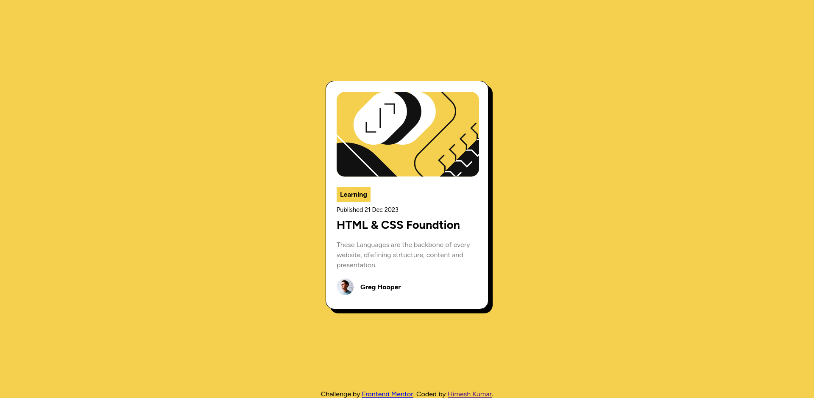

# Frontend Mentor - Blog preview card solution

This is a solution to the [Blog preview card challenge on Frontend Mentor](https://www.frontendmentor.io/challenges/blog-preview-card-ckPaj01IcS). Frontend Mentor challenges help you improve your coding skills by building realistic projects. 

## Table of contents

- [Frontend Mentor - Blog preview card solution](#frontend-mentor---blog-preview-card-solution)
  - [Table of contents](#table-of-contents)
  - [Overview](#overview)
    - [Screenshot](#screenshot)
    - [Links](#links)
  - [My process](#my-process)
    - [Built with](#built-with)
    - [What I learned](#what-i-learned)
  - [Author](#author)

## Overview

### Screenshot

### Links

- Solution URL: [Checkout solution on Frontend Mentor](https://www.frontendmentor.io/solutions/qr-code-component-using-semantic-html5-and-flexbox-VXk7I8MpUi)
- Live Site URL: [visit website](https://iamhimesh07.github.io/frontend-mentor-challenges/blog-preview-card/)

## My process

### Built with

- Semantic HTML5 markup
- Flexbox

### What I learned

By completing this project i learned about basic concept of Flexbox, Semantic HTML5 markup, box-shadow & display properties.

## Author

- Website - [Himesh Kumar](https://www.your-site.com)
- Frontend Mentor - [@iamhimesh07](https://www.frontendmentor.io/profile/iamhimesh07)
- Twitter - [@iamhimesh07](https://www.x.com/iamhimesh07)

